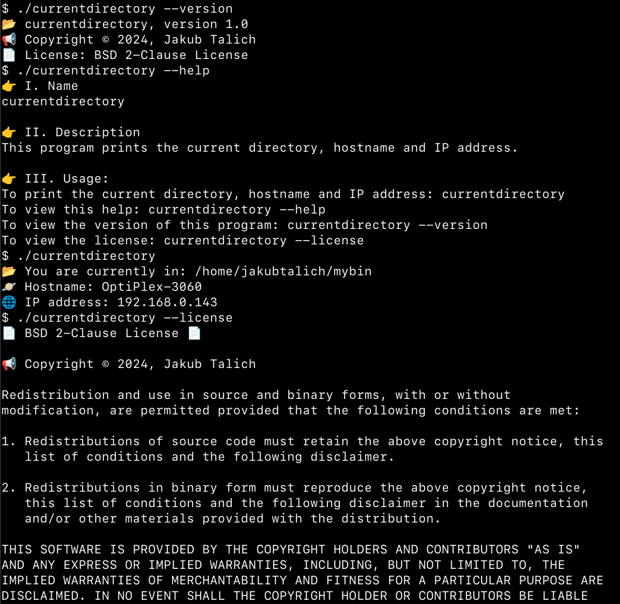

# currentdirectory
Get the 📂 current directory, 🪐 hostname and 🌐 IP address

Written in Nim 👑 (tested version: 2.2.0)

- **Supported OSes:** Linux 🐧, FreeBSD 😈, Illumos/Solaris ☀️

- **🔨 Building:**
  `$ cd src/ && nim c -d:release currentdirectory.nim`

- **🏃 Run options:**
  - `$ currentdirectory`
  - `$ currentdirectory --help`
  - `$ currentdirectory --version`
  - `$ currentdirectory --license`

 - **🎂 Version history:**
   - **1.0** (October 3 2024): initial release

- **Screenshot:**

